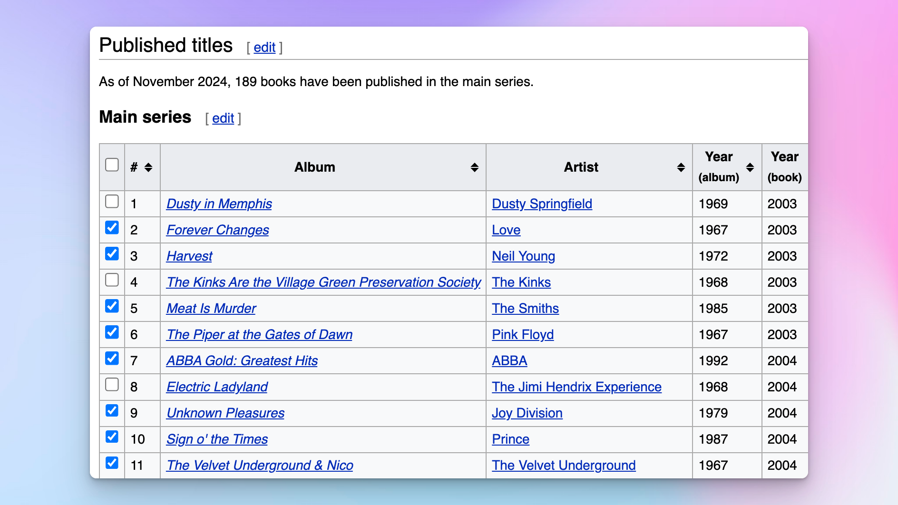
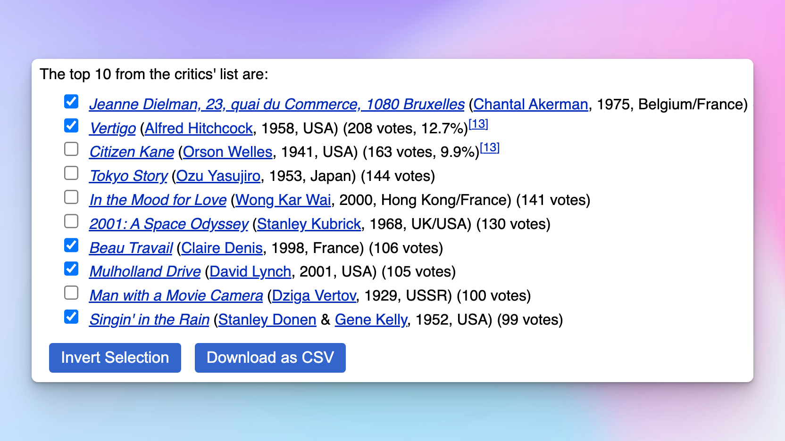
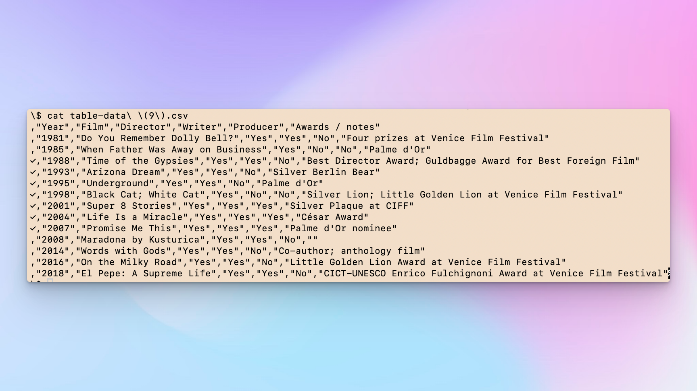

# Check On It: Add checkboxes and CSV export to Wikipedia tables and lists

[This Chrome extension](https://chromewebstore.google.com/detail/check-on-it-for-wikipedia/gpfanfohccjlckihfoceabdcbgbgkdca) enhances tables and lists on Wikipedia pages by adding interactivity and functionality like checkboxes, drag selection, and CSV export. Users can select elements dynamically and perform actions to simplify data extraction and organization.

## Features

- **Dynamic Element Selection**: Allows users to pick tables or lists from the page dynamically.
- **Enhancements**:
  - Add checkboxes to rows (tables) or items (lists).
  - Drag to select multiple checkboxes.
  - Invert checkbox selections.
  - Export table or list data (with checkbox column) as CSV.
- **Custom Styling**: Highlight elements during selection for better visibility.

## Usage

1. Navigate to a Wikipedia page.
2. Open the extension popup from the Chrome toolbar.
3. Select whether you want to enhance a **Table** or a **List**.
4. Hover over the desired table or list.
5. Double-click the desired table or list to enhance it.

## Enhancements Applied

### For Tables:
- Adds a column of checkboxes to each row.
- Includes:
  - **"Select All" Checkbox** in the header row.
  - **Invert Selection** button.
  - **Export to CSV** button.

### For Lists:
- Adds checkboxes to each list item.
- Includes:
  - **Invert Selection** button.
  - **Export to CSV** button.

## CSV Export

- **Tables**: All rows are exported to a CSV file. The file includes the new column with checkbox states.
- **Lists**: Items are exported as text including the new column with checkbox states.

## Keyboard and Mouse Shortcuts

- **Drag Selection**: Click and drag to select multiple checkboxes.
- **Invert Selection**: Use the button added below the enhanced element.

## Permissions

The extension requires the following permissions:
- `activeTab`: To manipulate elements on the currently active tab.
- `scripting`: To inject the enhancement script into web pages.

## Known Issues

- **Dynamic Content**: The extension may not work on dynamically loaded Wikipedia content without a page refresh.
- **Style Conflicts**: Custom page styles may interfere with the extension's styling.

## License

This project is licensed under the MIT License. See the `LICENSE` file for details.

## Screenshots

---
